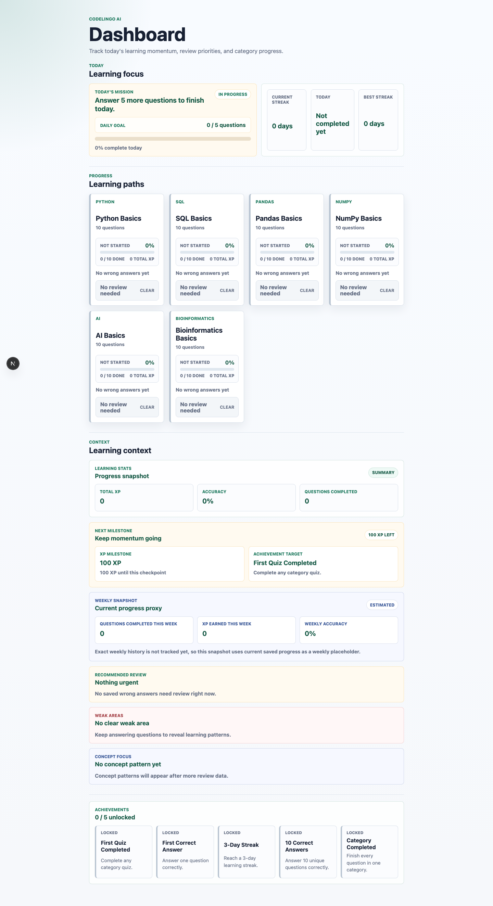
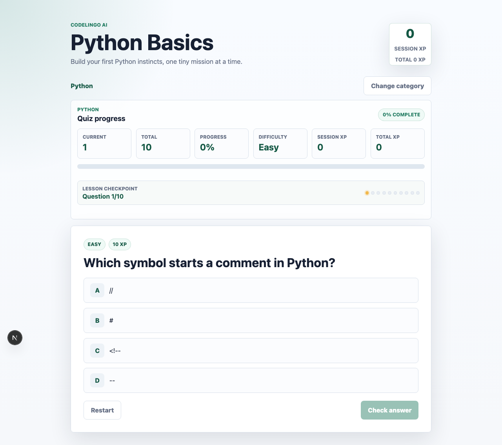
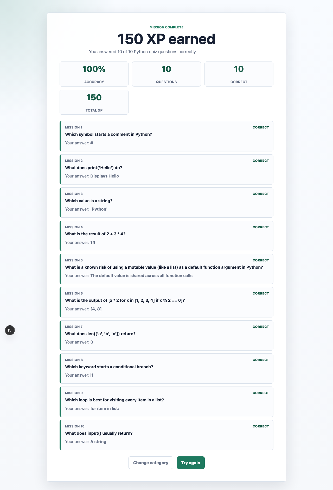

# CodeLingo AI Case Study

CodeLingo AI is a portfolio-ready coding microlearning app inspired by Duolingo-style learning systems. It helps learners practice Python, SQL, data analysis, AI, and bioinformatics through short quiz sessions, immediate explanations, XP progression, daily goals, review loops, and lightweight learning analytics.

## Project Links

- Live Demo: https://code-lingo-ai.vercel.app
- GitHub: https://github.com/ceohwj/code-lingo-ai
- Release Status: Public Release / Learning Platform v1
- Curriculum: 60 questions across 6 learning tracks

## Screenshots

Dashboard with daily mission, learning tracks, progress summaries, review prompts, and learning analytics:



Active quiz flow with difficulty, hint support, answer choices, and XP reward:



Completion summary with earned XP and answer review:



## 1. Background

CodeLingo AI was built as a portfolio-oriented learning product that demonstrates AI-assisted software engineering, scalable frontend architecture, educational product thinking, and retention-oriented UX.

The project started from a focused MVP goal: create a small but complete coding learning loop that users can understand quickly and return to daily. Instead of building a large course platform first, the app prioritizes the core learning behavior:

```text
Choose a track
  -> Answer a short quiz question
  -> Receive immediate feedback
  -> Read an explanation
  -> Earn XP
  -> Save progress
  -> Review weak areas
  -> Return through daily goals and streaks
```

The current public release is local-first and intentionally lightweight. It uses browser storage instead of accounts, databases, or backend APIs so the product experience, data model, and learning systems remain easy to inspect and explain.

## 2. Problem

Beginners often lose momentum when learning programming because many tools create too much friction: long lessons, delayed feedback, unclear explanations, and weak review loops. A learner may answer questions correctly once but still forget the concept later if the product does not support repetition and reflection.

The product problem was to design a learning experience that supports daily practice without overwhelming the user.

Key learning problems:

- New learners need quick practice sessions that fit into a daily routine.
- Feedback should be immediate and educational, not just correct or incorrect.
- Mistakes should turn into review opportunities.
- Progression should feel visible through XP, completion, streaks, and achievements.
- Curriculum should cover practical programming, data analysis, AI, and bioinformatics without becoming unfocused.

The engineering problem was to build these systems in an MVP-friendly way without prematurely adding backend complexity, global state, or heavy abstractions.

## 3. Solution

CodeLingo AI solves this with a local-first microlearning platform focused on one complete retention loop.

Product solution:

- Short multiple-choice quiz sessions by learning track
- Immediate answer feedback after submission
- Explanation cards that teach the concept after each answer
- Difficulty-based XP rewards
- Daily mission progress and streak tracking
- Achievement milestones for motivation
- Wrong-answer review mode
- Adaptive review recommendations
- Weak-area and concept-focus insights

Learning Analytics are built from existing learner activity instead of a separate analytics backend. The app derives total XP, accuracy signal, category progress, daily goal progress, wrong-answer counts, recommended review items, weak areas, and concept insights from local saved progress.

Curriculum Design is structured around 6 tracks:

| Track | Questions | Focus |
| --- | ---: | --- |
| Python | 10 | Syntax, data types, loops, functions, list comprehensions, mutable defaults |
| SQL | 10 | SELECT, WHERE, ORDER BY, GROUP BY, joins, aggregates, HAVING |
| Pandas | 10 | DataFrame, Series, CSV loading, indexing, filtering, groupby, merge, missing values |
| NumPy | 10 | Arrays, shape, dtype, vectorization, boolean indexing, aggregation, broadcasting, reshape |
| AI | 10 | Supervised learning, overfitting, features, labels, underfitting, evaluation |
| Bioinformatics | 10 | DNA/RNA basics, FASTA/FASTQ, sequence alignment, reference genomes, variant calling |

Each track follows a balanced 4 easy, 4 medium, 2 hard difficulty structure. Questions include explanations, XP rewards, concept tags, hints, and selected common mistake guidance.

## 4. Architecture

CodeLingo AI uses a modular Next.js and React architecture. The main design goal is to keep UI rendering, React orchestration, browser persistence, and testable learning logic separated.

```text
app/
  page.jsx                    Main learning flow orchestration
  layout.jsx                  Metadata and app shell
  globals.css                 Responsive styling

components/
  CategorySelector.jsx        Dashboard, category cards, review entry points
  QuizCard.jsx                Question, choices, hint, answer submission
  ExplanationCard.jsx         Immediate feedback and explanation
  ProgressBar.jsx             Progress, difficulty, and XP summary
  QuizHero.jsx                Quiz session header
  QuizResults.jsx             Quiz and review completion summary
  LearningStatsPanel.jsx      Total XP, accuracy, completed questions
  NextMilestonePanel.jsx      XP milestone and achievement target
  WeeklyLearningSnapshot.jsx  Current-progress weekly snapshot proxy

hooks/
  useQuizProgressStorageState.js
  useWrongAnswerHistory.js
  useCategoryProgressSummaries.js
  useDailyGoalState.js
  useStreakState.js
  useAchievementState.js
  useAdaptiveReviewRecommendations.js
  useWeakAreaInsights.js
  useConceptFocusInsights.js

lib/
  quizLogic.js
  quizProgressLogic.js
  categoryProgressLogic.js
  dailyGoalLogic.js
  streakLogic.js
  achievementLogic.js
  adaptiveReviewLogic.js
  weakAreaInsightLogic.js
  conceptAnalyticsLogic.js
  wrongAnswerHistoryLogic.js

data/
  quizData.js
  questions/*.json
```

Architecture principles:

- UI components focus on rendering and lightweight interactions.
- Hooks manage React state and `localStorage` orchestration.
- Pure learning logic lives in `lib/` for focused tests.
- Static curriculum data lives in `data/questions/`.
- XP, streaks, achievements, review, weak areas, and analytics stay loosely coupled.
- Derived state is preferred over duplicated state.

This structure keeps the MVP scalable for future backend sync, authentication, database-backed analytics, AI tutor features, and content management without requiring a major rewrite.

## 5. Multi-Agent Workflow

The project uses a documented AI Workflow that simulates a small product and engineering team.

| Agent | Role | Contribution |
| --- | --- | --- |
| ChatGPT | Product Owner, PM, Architecture Reviewer, UX Strategist, Portfolio Strategist | Defined priorities, protected MVP scope, reviewed architecture, shaped product positioning |
| Codex | Production Engineer, Rapid Implementation Agent | Implemented scoped features, generated quiz datasets, created reusable logic, updated documentation |
| Antigravity | Tech Lead, Local Build Engineer, Integration Agent | Integrated changes locally, verified runtime behavior, ran tests/build, reviewed mobile UX |

The workflow is documented in:

- `AGENTS.md`
- `WORKFLOW.md`
- `WORKFLOW_MAP.md`
- `CODEX_TASK_PROMPT.md`
- `CODEX_QUIZ_GENERATOR_PROMPT.md`
- `CODEX_REPORT_PROMPT.md`
- `ANTIGRAVITY_REVIEW_PROMPT.md`
- `PROJECT_STATUS.md`
- `docs/DAILY_LOG.md`

This makes the project portfolio-relevant beyond the app itself. It shows how AI tools can support product planning, implementation, QA, curriculum generation, documentation, and release preparation while preserving engineering discipline.

## 6. Technical Challenges

### Category-Specific Progress Without Breaking Existing Data

The app expanded from a simpler quiz flow into 6 learning tracks. The challenge was to support category-specific progress while preserving compatibility with earlier saved progress.

The solution was to centralize category progress logic, use category-specific storage keys, and keep storage orchestration in focused hooks.

### Session XP Versus Saved XP

Quiz retry and review flows can corrupt progress if session state and saved totals are mixed together.

The solution was to separate session XP from saved category XP. Review mode awards no XP, and retry starts a new session while preserving saved category completion and total XP.

### Review Systems Without Tight Coupling

Wrong-answer review, adaptive recommendations, weak-area insights, and concept analytics use related signals but should not directly mutate each other.

The solution was to store wrong-answer history by category, then derive recommendations and insights from saved progress, difficulty, recency, and concept tags.

### MVP Scope Control

The project could have expanded too early into accounts, AI chat, backend sync, leaderboards, and analytics dashboards.

The solution was to ship a stable local-first v1 before adding platform complexity. This kept the learning loop clear, testable, and portfolio-friendly.

## 7. QA Process

The QA process combines unit tests, production build checks, curriculum review, and browser/mobile learning-flow validation.

Validation status:

- `npm test` passed with 85/85 tests
- `npm run build` passed successfully in Turbopack mode
- Mobile QA completed at 375px, 390px, and 430px widths
- Curriculum QA completed across all 60 questions and 6 categories
- Public release UX review completed

Test coverage includes:

- Quiz data schema and category registration
- Answer checking and feedback
- Difficulty-based XP
- Submitted-answer replacement
- Quiz retry and XP persistence
- Category progress summaries
- Daily goals
- Streaks
- Achievements
- Wrong-answer history
- Adaptive review recommendations
- Weak-area insights
- Concept analytics

Browser QA covered category selection, quiz progression, hint rendering, explanation rendering, XP accumulation, refresh restore, Try again behavior, wrong-answer review, recommended review, weak-area insights, concept focus, achievements, daily goals, streaks, dashboard hierarchy, and mobile layout.

## 8. Deployment

CodeLingo AI is deployed publicly on Vercel:

- Live Demo: https://code-lingo-ai.vercel.app
- Framework: Next.js
- Runtime environment variables: none required
- Backend services: none in v1
- Database services: none in v1
- Authentication providers: none in v1

The deployment is low-risk because the current release is local-first. User progress is stored in the browser, and the app does not depend on external secrets, API keys, databases, or server-side learning state.

Public release assets include:

- `public/favicon.ico`
- `public/icon.png`
- `public/og-image.png`
- `public/screenshots/home.png`
- `public/screenshots/quiz.png`
- `public/screenshots/results.png`

## 9. Lessons Learned

The most important lesson was that a strong learning product does not need a large feature set first. It needs a clear feedback loop, meaningful repetition, and reliable progress tracking.

Product lessons:

- Retention systems are more valuable when connected to real learning behavior.
- Explanations and review loops matter more than raw question count.
- Beginner-friendly UX benefits from simple choices, visible progress, and immediate correction.
- Curriculum metadata such as difficulty, XP reward, concept tags, hints, and common mistakes creates room for future personalization.

Engineering lessons:

- Local-first architecture is effective for validating a learning loop before backend investment.
- Pure logic modules make quiz, XP, streak, review, and analytics behavior easier to test.
- Derived analytics reduce state complexity and avoid multiple sources of truth.
- Documentation improves portfolio value when it explains decisions, not just features.

AI Workflow lessons:

- AI agents are most useful when each one has a clear role.
- Prompt templates help keep work scoped and repeatable.
- Human-level product judgment is still needed to prevent feature overload.
- QA and documentation agents are important for turning a demo into a credible portfolio project.

## 10. Future Roadmap

Near-term portfolio improvements:

- Link this case study from `README.md`.
- Add a short demo GIF or video walkthrough.
- Keep screenshots current as the dashboard evolves.
- Continue reducing page-level state complexity when safe.

Learning product improvements:

- Add practical mini challenges.
- Add real dataset examples.
- Expand machine learning, XAI, and healthcare data tracks.
- Improve explanation consistency across all categories.
- Add spaced repetition and personalized review scheduling.
- Add adaptive difficulty based on learner history.

Platform improvements:

- Add backend progress sync.
- Add authentication.
- Add database-backed learning analytics.
- Add a content management workflow for quiz datasets.
- Add monitoring and deployment health checks.

AI-assisted learning improvements:

- Add personalized AI explanations.
- Add personalized hints based on wrong-answer history.
- Add AI-generated review quizzes.
- Add concept summaries for repeated weak areas.
- Add an AI tutor mode once the core learning data model is stable.
