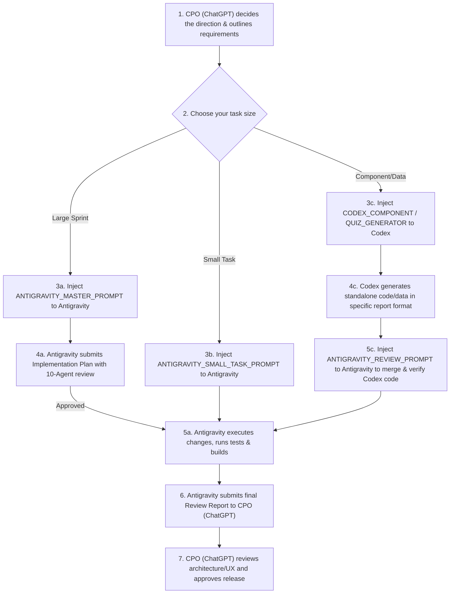

# WORKFLOW_MAP.md - AI-Assisted Development Navigation Map

Welcome! This map helps developers and AI agents navigate the CodeLingo AI multi-agent workflow. Use the guidelines below to choose the correct prompt for your specific task.

---

## 🗺️ Prompt Selection Quick Reference

| What are you trying to do? | Recommended Prompt | Target AI Agent |
| :--- | :--- | :--- |
| **Big Sprint / Large Feature / Architectural Change** | [ANTIGRAVITY_MASTER_PROMPT.md](file:///Users/junghyunwoo/Documents/code-lingo-ai/ANTIGRAVITY_MASTER_PROMPT.md) | **Antigravity** (Gemini) |
| **Quick Bug Fix / Minor Text Tweak / Small Script** | [ANTIGRAVITY_SMALL_TASK_PROMPT.md](file:///Users/junghyunwoo/Documents/code-lingo-ai/ANTIGRAVITY_SMALL_TASK_PROMPT.md) | **Antigravity** (Gemini) |
| **Create a New UI Component (with Vanilla CSS)** | [CODEX_COMPONENT_PROMPT.md](file:///Users/junghyunwoo/Documents/code-lingo-ai/CODEX_COMPONENT_PROMPT.md) | **Codex** (GPT/Fast Gen) |
| **Generate a New Quiz Dataset (JSON questions)** | [CODEX_QUIZ_GENERATOR_PROMPT.md](file:///Users/junghyunwoo/Documents/code-lingo-ai/CODEX_QUIZ_GENERATOR_PROMPT.md) | **Codex** (GPT/Fast Gen) |
| **Refactor or Optimize an Isolated Code Block** | [CODEX_REFACTOR_PROMPT.md](file:///Users/junghyunwoo/Documents/code-lingo-ai/CODEX_REFACTOR_PROMPT.md) | **Codex** (GPT/Fast Gen) |
| **Merge, Test, and Verify Codex's Code Locally** | [ANTIGRAVITY_REVIEW_PROMPT.md](file:///Users/junghyunwoo/Documents/code-lingo-ai/ANTIGRAVITY_REVIEW_PROMPT.md) | **Antigravity** (Gemini) |
| **Consolidate Multiple Codex Reports Together** | [CODEX_REPORT_PROMPT.md](file:///Users/junghyunwoo/Documents/code-lingo-ai/CODEX_REPORT_PROMPT.md) | **Codex** (Consolidator) |

---

## 🔄 The Hybrid AI Development Loop

---

## 📝 Report Standard Headers

Whenever an agent returns a report, it must strictly use the designated report header for easy tracking:

* **Antigravity Master Work:** `# Antigravity Master Report`
* **Antigravity Small Task:** `# Antigravity Small Task Report`
* **Antigravity Codex Review:** `# Antigravity Review Report`
* **Codex Component Design:** `# Codex Component Report`
* **Codex Quiz Gen:** `# Codex Quiz Generation Report`
* **Codex Refactor:** `# Codex Refactor Report`
* **Codex Multi-Report Consolidation:** `# Codex Unified Report`
